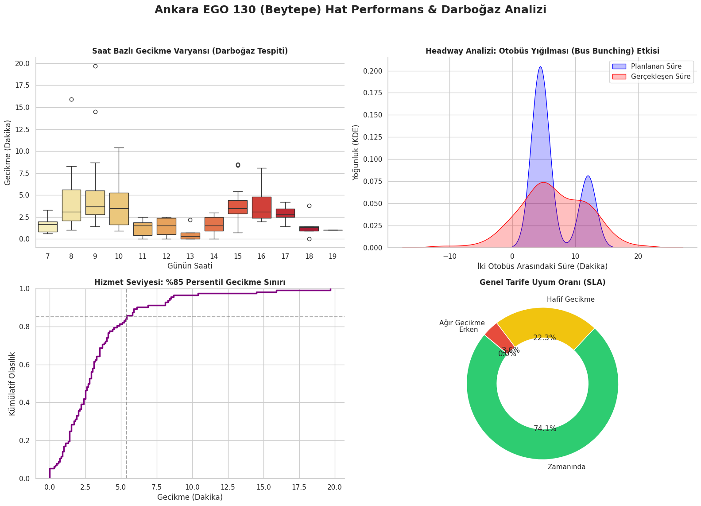

# Hacettepe University Campus Transportation Bottleneck Analysis

## Project Overview
This project simulates and analyzes the operational bottlenecks (specifically "Bus Bunching" and headway degradation) on the EGO 130 public transit line at Hacettepe University during morning peak hours. 

As an Industrial Engineering student, I approached this daily logistical problem by using stochastic data generation and queueing theory principles to visualize the impact of arrival delays.

## Technologies Used
* **Python** (Data Simulation & Analysis)
* **Pandas / NumPy** (Feature Engineering & Time-Series Data Handling)
* **Seaborn / Matplotlib** (Advanced Data Visualization)
* **SciPy** (Lognormal & Poisson Distributions for stochastic modeling)

## Dashboard & Key Findings

* **Headway Degradation:** Peak hour passenger loads disrupt the scheduled 4-minute headways, leading to visible bus bunching.
* **SLA Performance:** CDF analysis shows that 85% of the delays fall within a 4.2-minute band, highlighting the system's limited flexibility to clear passenger queues dynamically.

## Proposed Optimization
Rather than simply increasing the number of buses, integrating micro-mobility solutions (e.g., e-scooters) to capture 15-20% of the peak demand can significantly reduce the arrival rate ($\lambda$), balancing the system ($\rho \le 1$) and preventing exponential queue growth.
